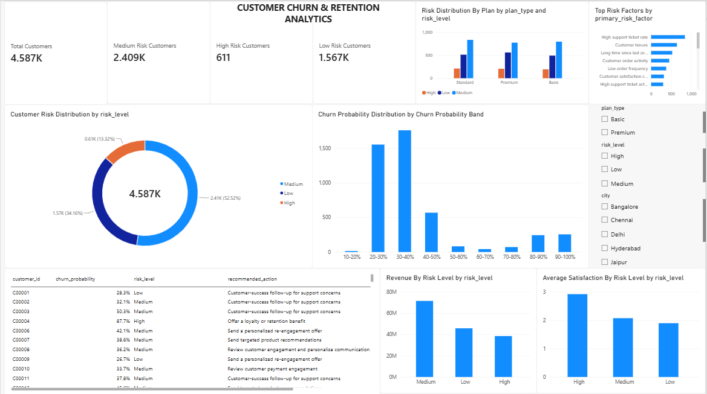
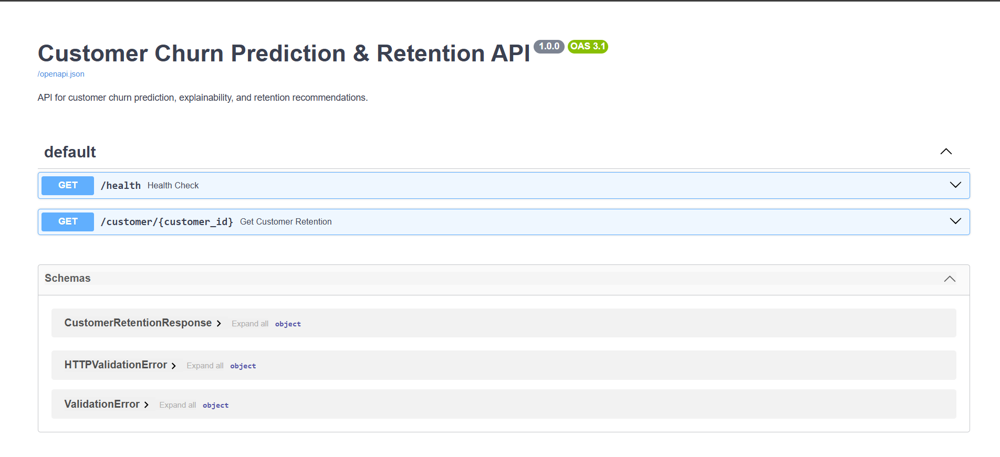

# Customer Churn Prediction & Retention Platform

An end-to-end machine learning platform that predicts customer churn probability, explains the factors behind each prediction, and generates business-oriented customer retention recommendations.

The project combines data engineering, SQL analytics, machine learning, explainable AI, API development, experiment tracking, automated testing, and business intelligence into a single workflow.

---

## 📌 Project Overview

Customer churn is an important business problem because losing existing customers can directly affect revenue and customer lifetime value.

This project builds a complete churn analytics pipeline that:

1. Generates and stores customer-related data
2. Loads data into PostgreSQL
3. Performs SQL-based customer analytics
4. Creates a machine-learning dataset
5. Performs exploratory data analysis
6. Engineers behavioral and business features
7. Trains and compares multiple machine-learning models
8. Tunes a Random Forest model
9. Predicts customer churn probability
10. Explains predictions using SHAP
11. Assigns customer risk levels
12. Generates retention recommendations
13. Exposes predictions through a FastAPI REST API
14. Tracks experiments and registers models using MLflow
15. Tests the API and data pipeline using Pytest
16. Provides an interactive Power BI dashboard

---

## 🏗️ System Architecture

```text
                 ┌──────────────────────┐
                 │   Synthetic Data     │
                 │      Generator       │
                 └──────────┬───────────┘
                            │
                            ▼
                 ┌──────────────────────┐
                 │     PostgreSQL       │
                 │     Customer DB      │
                 └──────────┬───────────┘
                            │
                       SQL Analytics
                            │
                            ▼
                 ┌──────────────────────┐
                 │ Data Cleaning &      │
                 │ Feature Engineering  │
                 └──────────┬───────────┘
                            │
                            ▼
                 ┌──────────────────────┐
                 │   Machine Learning   │
                 │ Logistic Regression  │
                 │ Decision Tree        │
                 │ Random Forest        │
                 │ XGBoost              │
                 └──────────┬───────────┘
                            │
                       Model Tuning
                            │
                            ▼
                 ┌──────────────────────┐
                 │  Random Forest       │
                 │   Final Model        │
                 └──────────┬───────────┘
                            │
              ┌─────────────┴─────────────┐
              ▼                           ▼
     ┌──────────────────┐       ┌──────────────────┐
     │      SHAP        │       │     MLflow       │
     │ Explainability   │       │ Tracking &       │
     │                  │       │ Model Registry   │
     └────────┬─────────┘       └──────────────────┘
              │
              ▼
     ┌──────────────────────┐
     │ Retention Engine     │
     │ Risk Level + Actions │
     └──────────┬───────────┘
                │
                ▼
        ┌──────────────────┐
        │     FastAPI      │
        │    REST API      │
        └────────┬─────────┘
                 │
                 ▼
        ┌──────────────────┐
        │    Power BI      │
        │    Dashboard     │
        └──────────────────┘

## 📊 Power BI Dashboard

The project includes an interactive Power BI dashboard for monitoring customer churn risk and retention insights.

### Dashboard Highlights

- Total customers
- High-risk customers
- Medium-risk customers
- Low-risk customers
- Customer risk distribution
- Churn probability distribution
- Risk distribution by plan
- Top risk factors
- Revenue by risk level
- Average recorded satisfaction by risk level
- Customer-level retention actions

### Interactive Filters

- Plan Type
- Risk Level
- City



## 🚀 FastAPI API

The trained churn model is exposed through a FastAPI REST API.

### API Endpoints

| Method | Endpoint | Description |
|---|---|---|
| GET | `/health` | Check API health |
| GET | `/customer/{customer_id}` | Get churn prediction and retention recommendation |

### Swagger API Documentation

FastAPI provides interactive API documentation through Swagger UI.

